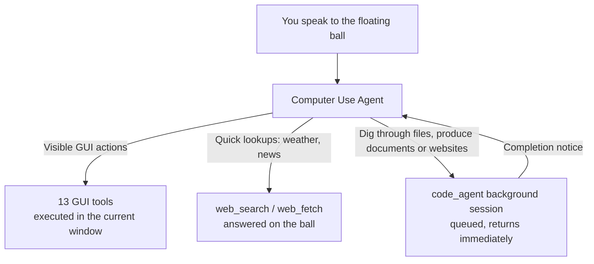

<p align="center"></p>

# dsh-orb

English | [中文](README.zh-CN.md)

An unofficial personal plugin for [DeepSeek Harness](https://github.com/deepseek-ai/deepseek-harness) (dsh). One installable bundle that adds a floating-ball agent with Computer Use to the official dsh desktop app and `dsh web` — the official repository stays untouched, and the main window remains the official dsh Web UI.

> **Disclaimer** — This is an unofficial project maintained by an individual developer. It is **not** affiliated with, endorsed by, or connected to DeepSeek AI in any way. DeepSeek, the DeepSeek logo, and the DeepSeek avatar artwork are the property of DeepSeek AI; they appear here only as the default ball avatar shipped by the upstream project.

A floating ball rests at the right edge of your screen. Tell it what you need: quick, visible actions are executed directly in the current app through Computer Use; long-running complex tasks are dispatched to a background coding session, and the result comes back to the ball when it finishes. The main window keeps the full dsh Web UI — session management, the plugin market, and model settings — so you can still write code, edit files, and run commands in it.

There is no telemetry.

## The floating ball

On startup the plugin spawns its own helper (a pinned, verified Electron runtime in an isolated profile) and the ball appears at the right edge of the primary display, always on top.

- **Hover** expands the panel, **click** pins it, and it collapses when the pointer leaves. **Drag** moves the ball; dragging it beyond the left or right screen edge docks it into a thin sliver — hover again to slide it back.
- **Right-click** opens the menu: open the main window, floating-ball agent settings and background agent settings (each track picks its own model and thinking level), the coordinate-encoding toggle, and "Disable floating ball". The ball follows the official dsh process — when the official app exits, the ball exits with it.
- The panel carries the ball's conversation history with **History** and **New**, an **Access** chip (view-only / workspace edits / full access; full by default, applying to the ball's commands and the background sessions it dispatches), and a composer that wraps around the ball. When the agent asks you a question, the question card is answered right on the ball; if the helper disconnects, an unanswered question is handed back to the main window.
- The transcript is rendered natively in the ball: streaming thinking / text / tool calls interleaved in arrival order, collapsible tool cards with parameters and results (terminal, diff, read, search, web), Shiki dual-theme highlighting, copy buttons for user and assistant messages, and a per-turn token-usage pill.
- Appearance follows the main window: dark / light theme and interface language (Chinese / English) mirror the official appearance and language settings, including live switching.
- The ball avatar can be set to one of six built-in animated GIFs, or replaced with a custom GIF / PNG / WebP (2 MB cap), in main-window **Settings → Floating Ball**. The built-ins stay animated: the ball plays them whenever it is active, exactly like the shipped default.

## Dual-track agent architecture

The Computer Use agent inside the floating ball decides how every message is handled; there is no separate task classifier at runtime:



- **Foreground track · Computer Use**: visible operations — opening apps, clicking buttons, filling forms, changing settings — are executed with GUI tools right in front of you, each step based on a live screenshot of the frontmost window. Quick lookups such as weather or news headlines stay on the ball too, answered directly with `web_search` / `web_fetch`.
- **Background track · Code Agent**: complex tasks — digging through files, producing documents, building a website — are dispatched through `code_agent` to a background standard session. Dispatch returns immediately; the ball tells you the background is running and you can keep chatting. When the background session ends and the ball is idle, the completion summary returns to the ball automatically, and the Computer Use agent decides the next move — keep clicking, dispatch more background work, or wrap up.

A background session is the same kind of session you create manually in the main window; it appears in the `dsh_orb` folder in the main-window sidebar, where you can open, continue, or stop it. Follow-up changes to the same deliverable go back to the same background session; unrelated new work opens another one. The conversation history, permissions, and per-track model settings are shared with the official dsh process — the ball reads and writes the same sessions as the main window.

## Computer Use

Every conversation on the ball runs Computer Use: the first message automatically attaches a screenshot of the frontmost app's visible windows, and another screenshot follows every action, including your mouse cursor, so the model always sees the latest screen state.

- While the agent operates, screenshots automatically omit the ball, the expanded panel, and the observation border, and clicks pass through the ball instead of landing on it; the observed window gets a glowing observation border marking what the agent is looking at. Outside of agent operations the ball is a normal window you can screenshot and record.
- Tool list: `click` (single/double/right click, hold modifiers), `input_text`, `scroll`, `hotkey`, `long_press`, `drag`, `wait`, `long_wait`, `screenshot` (saved to the Desktop and copied to the clipboard), `open_in_browser`, `open_in_finder`, `list_apps`, `open_app`.
- **macOS**: the first time you operate the screen, the system permission dialogs are attributed to **DeepSeek Harness** (desktop) or your terminal (`dsh web`) — authorize that process. The ball's onboarding layer walks you through Screen Recording and Accessibility.
- **Windows**: no system-permission onboarding is needed; windows running as administrator refuse to be clicked or typed into.
- Installing this plugin is the consent gate: the GUI tools never ask per click.

## How it works

```
DeepSeek Harness (official, unmodified)
└─ Electron shell (main window, dsh://open, single instance)
     └─ Host, spawned as a plain Node process (ELECTRON_RUN_AS_NODE=1)
          └─ dsh-orb plugin
               ├─ host — sessions, permissions, models, web routes, helper lifecycle
               ├─ computer-use — 13 GUI tools + code_agent (Computer Use preset)
               └─ client-settings — the "Floating Ball" section in main-window settings

Helper (its own downloaded Electron, isolated userData)
├─ ball window, observation border
└─ data requests → authenticated loopback URL of the official Host
```

- One package to install: the `dsh-orb` bundle assembles the host, the Computer Use plugin, the helper, and the settings page into itself at build time.
- The helper runtime is a stock Electron release pinned by SHA-256 (darwin/win32, arm64/x64), downloaded on first use and verified against the pinned hashes; it runs in its own `userData`, separate from the official app.
- The helper talks to the host over a loopback-only NDJSON socket authenticated with a random 32-byte token generated per launch, passed by environment variable — never argv, never written to disk. Authenticated URLs with official credentials never reach the helper.
- Watchdog: the helper exits when it loses the socket; the host restarts it at most three times. Computer Use in the main window keeps working even if the ball cannot start.

## Requirements

- [DeepSeek Harness](https://github.com/deepseek-ai/deepseek-harness): the desktop app, or `dsh web` from the CLI. Built against dsh `0.1.7-rc.2`; the declared compatibility range is `>=0.1.7-rc.2 <0.3.0-0`.
- macOS (Apple Silicon / Intel) or Windows x64. Linux loads the plugin but does not create a ball — background code sessions still work.
- Node.js `^22.19.0 || >=24.0.0` and pnpm `11.7.0` (only for building from source).

## Install

### From a release

Once published to npm, install by package name:

- **Desktop app**: in the app, open the plugin page and add the package name `dsh-orb`.
- **CLI** (`dsh web`): `dsh plugin add dsh-orb`.

### From a local build

```sh
pnpm install
pnpm build
pnpm --filter dsh-orb pack        # produces ./dsh-orb-0.0.0.tgz
```

Then either add the tarball in the desktop app's plugin page, or:

```sh
dsh plugin add ./dsh-orb-0.0.0.tgz
```

After the first installation the helper's Electron runtime is downloaded on first use of the ball, then cached.

## Development

```sh
pnpm typecheck   # tsc over all packages
pnpm test        # node:test suites + vitest suites (computer-use)
pnpm build       # build every package and assemble the bundle
```

The design documents this plugin was built from live in [docs/](docs/) — feasibility analysis, architecture, phased plan, and the running addendum of post-design revisions.

## Status and known limitations

- The **selection toolbar** (search / translate / send-to-agent on text selection) is temporarily disabled while a defect is fixed; its code ships but every entry point is removed and the feature is forced off in preferences.
- Built and tested against dsh `0.1.7-rc.2`; newer dsh versions within the compatibility range may require re-verification.
- No floating ball on Linux; headless environments can still run background code sessions.
- The macOS permission dialogs name DeepSeek Harness or your terminal, not this plugin — that is how the OS attributes permissions to the process that hosts the agent.

## Relationship to DeepSeek Harness

This repository is an unofficial derivative work built on top of [deepseek-ai/deepseek-harness](https://github.com/deepseek-ai/deepseek-harness), dsh's open-source everything-is-a-plugin agent harness; sessions, plugins, tools, and the Web UI are all driven by it. This project modifies no upstream code — it installs like any third-party dsh plugin. To go deeper:

- [docs/01-analysis.md](docs/01-analysis.md) — feasibility and product decisions
- [docs/02-architecture.md](docs/02-architecture.md) — processes, packages, communication, security
- [packages/computer-use/README.md](packages/computer-use/README.md) — the GUI tools, coordinate encoding, and permission details

## License

[MIT](LICENSE). Upstream-derived code and assets are disclosed in [THIRD-PARTY-NOTICES.md](THIRD-PARTY-NOTICES.md).
